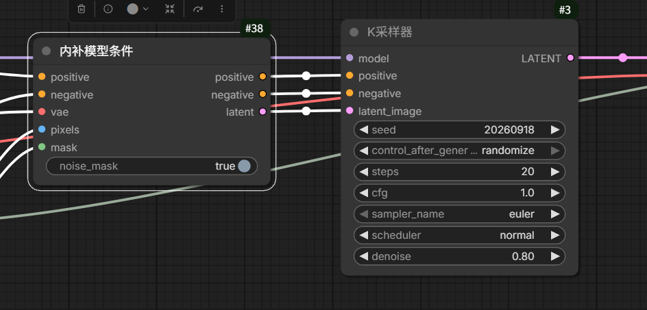
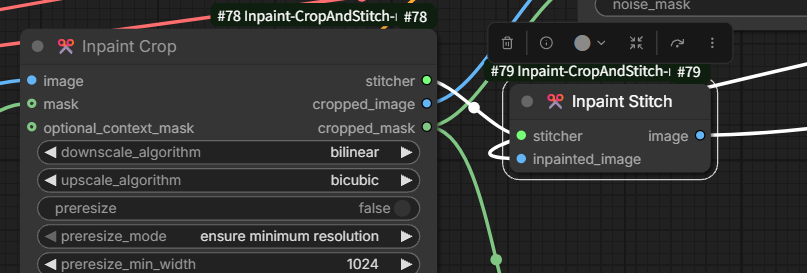
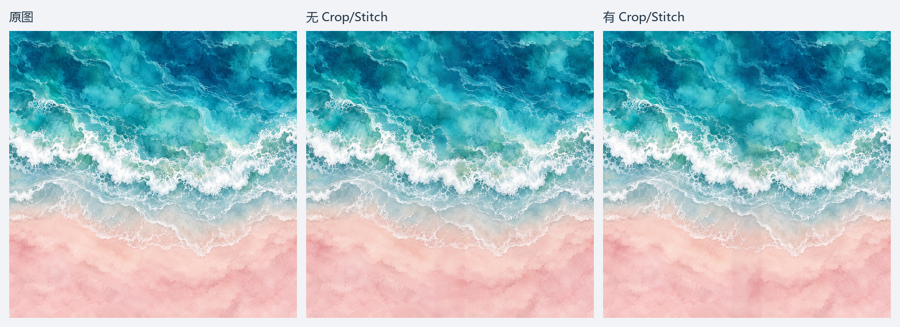
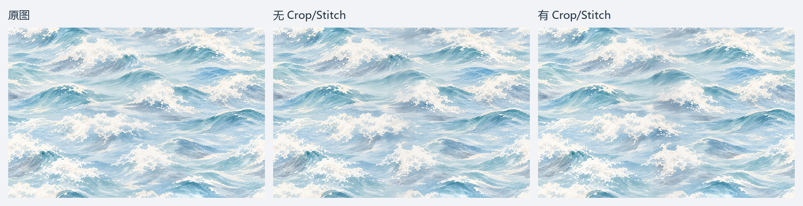
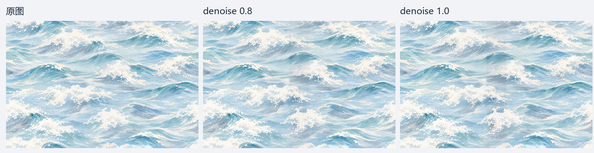
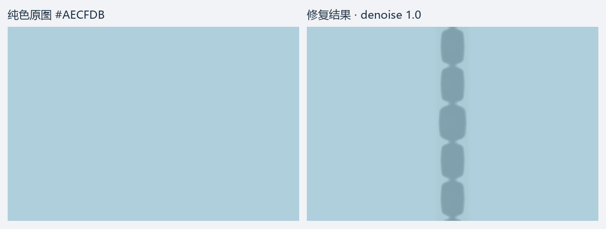

# Flux.1 局部重绘暗带原因定位实验

2026年9月18日 · 阶段记录：已复现异常，根因未确定
## 记录
前段时间一直在做包装纸的局部修复，用到ComfyUI中的局部重绘思路，也就是用Mask控制采样范围。原本以为是一个很简单的活，没想到却一路踩坑...

之所以觉得可能会简单，是因为局部修复的工作流其实结构很简单，核心的节点也就是内部条件和K采样。

但用Flux.fill和Flux.klein实验下来，发现基础的工作流效果并不好。
后来经过在社区的经验收集，又加入了 Inpaint Crop 节点。希望能让模型吃到更多的上下文。

加入这个节点后，似乎让模型直接画错的概率下降了。但黑影的问题却一直存在，它像是幽灵一样，难以定位和复现。时有时无，有时候以为解决了，又冷不丁冒出来。
后来经过蹲守观察，这类问题似乎只在“某些特定的图”上显现。我保留了两张可以复现出这个问题的图片。希望这两张图片能作为笼子抓住问题的根因，但是似乎只是止步于复现了此问题，至于为什么出现，还是感到困惑。目前仅做VAE编解码时，未复现同样的明显暗带，但尚不能完全排除VAE的影响，做了一份简要的实验报告。

## 目前知道了什么

**在本次样本与配置下，Crop/Stitch 没有消除暗带；将 denoise 从 0.8 提高到 1.0 也没有解决。纯色输入同样生成了异常深色块，而且在 Stitch 贴回之前已经存在。**

这不是修复成功的教程，而是一次尚未找到根因的排查记录。两张纹理图是从历史问题中选出的样本，并非随机抽样；其他图片不一定出现同样问题，不能据此推算发生率，也未证明同一配置会随机时好时坏。

## 四轮实验

| 实验 | 改了什么 | 观察与边界 |
| --- | --- | --- |
| 仅 VAE 编码—解码 | 两张图各裁出中央约 10% 竖条，独立编码解码后硬贴回 | 肉眼未看到此前那种明显暗带，但像素有变化；不能完全排除 VAE。 |
| 有／无 Crop/Stitch | 两张图各跑两组，统一模型和采样参数，denoise=0.8 | 两种流程均出现中央异常，不能认定加节点就解决了问题。 |
| denoise=1.0 | 海浪图沿用有节点流程，只调整降噪强度 | 暗带仍可见，提高降噪强度在本例中无效。 |
| 纯色输入 | 用纯浅蓝图替换海浪图，沿用上一轮配置 | 中央生成一串深色块，Stitch 前已有；与纹理图暗带是否同因仍未知。 |

## 图像对照

以下对比图只作等比例缩小展示，没有增强色差。需要判断细微差异时，请打开各组的原尺寸图片。公开附件清除了工作流等非必要 PNG 元数据，像素及尺寸保持不变；不包含服务器回执、内部路径或运行脚本。

### 1. 仅 VAE 编码—解码

中央竖条先用边缘复制补齐至 8 的倍数，再编码、解码、去掉补边并原位硬贴回。两侧不进入 VAE；没有扩散采样、融合或亮度补偿。

本次主观观察未复现明显暗带；原实验数值核验显示中央像素发生重建变化，两侧像素不变。这里的窄条处理方式并不等同于整套局部重绘流程。

海岸图：[输入](assets/dark-band-2026-09-18/coast-input.png) · [VAE 结果](assets/dark-band-2026-09-18/coast-vae.png)

海浪图：[输入](assets/dark-band-2026-09-18/waves-input.png) · [VAE 结果](assets/dark-band-2026-09-18/waves-vae.png)

### 2. 有／无 Crop/Stitch

每行从左到右为原图、无节点、有节点，每幅缩至 500px 宽。

原尺寸：[海岸输入](assets/dark-band-2026-09-18/coast-input.png) · [无节点](assets/dark-band-2026-09-18/coast-without.png) · [有节点](assets/dark-band-2026-09-18/coast-with.png)

原尺寸：[海浪输入](assets/dark-band-2026-09-18/waves-input.png) · [无节点](assets/dark-band-2026-09-18/waves-without.png) · [有节点](assets/dark-band-2026-09-18/waves-with.png)

海浪图有节点组仍有中央竖向异常。缩略图容易掩盖问题，不能只凭缩略图认定修复成功。

### 3. denoise 从 0.8 提高到 1.0

从左到右为原图、0.8、1.0，每幅缩至 512px 宽；两组均采用 Crop/Stitch。

原尺寸：[0.8 结果](assets/dark-band-2026-09-18/waves-with.png) · [1.0 结果](assets/dark-band-2026-09-18/waves-denoise1.png) · [1.0 贴回前输出](assets/dark-band-2026-09-18/waves-denoise1-raw.png)

提高到 1.0 后，中央异常仍存在。

### 4. 换成纯色输入

输入为 1536×1024 的纯浅蓝图，RGB=(174,207,219)，即 `#AECFDB`。左为输入，右为结果，每幅缩至 608px 宽。

原尺寸：[纯色输入](assets/dark-band-2026-09-18/solid-input.png) · [最终结果](assets/dark-band-2026-09-18/solid-result.png) · [贴回前输出](assets/dark-band-2026-09-18/solid-raw.png) · [Crop 后输入](assets/dark-band-2026-09-18/solid-crop.png)

中央出现分节状深色内容，不只是均匀变暗。原始 Mask 区域内平均 RGB 从 `(174,207,219)` 变为约 `(141.59,173.22,185.61)`；不能把这个均值直接当成统一加亮的补偿量。

贴回前已有异常，因此不能仅归因于最后的 Stitch 融合。但这还不能区分采样、VAE 解码及其相互作用，也不能证明它与海浪图暗带是同一种机制。

## 主要参数

| 项目 | 配置 |
| --- | --- |
| 输入 | 海岸 1264×1264；海浪及纯色 1536×1024 |
| Mask | 中央约 10% 竖条，贯穿全高；没有图像偏移 |
| Mask 坐标 | 海岸 x∈[569,695)，海浪及纯色 x∈[691,845)，右端不含 |
| 模型／VAE | `flux1-fill-dev.safetensors`，`weight_dtype=default`／`flux-ae.sft` |
| 文本编码器 | `clip_l.safetensors` + `t5xxl_fp16.safetensors` |
| 采样 | seed=20260918；20 步；Euler/normal；CFG=1；FluxGuidance=35 |
| 提示词及其他 | 正负提示词为空；DifferentialDiffusion strength=1；noise_mask=true |
| Crop/Stitch | 目标 1024×1024；padding=32；context factor=1.2；mask_blend_pixels=32 |
| denoise | 第二轮 0.8；第三、四轮 1.0；第一轮无采样 |

仅 VAE 实验中，海岸竖条左右各补 1px，实际编码尺寸为 128×1264；海浪竖条左右各补 3px，实际编码尺寸为 160×1024。解码后去掉补边，保留原图尺寸。

## 这次还不能回答什么

- 有／无 Crop/Stitch 的对比同时涉及画布尺寸、Mask 处理和融合差异，是流程整体对照，不是严格的单变量节点实验。不同尺寸下，同一个种子也不代表逐位置相同的噪声。
- 没有定位暗带首次产生的准确环节，不能认定采样器或 VAE 单独导致问题。
- 未测试其他正常样本在同配置下的表现，也未做多种子重复实验。
- 两张纹理图使用当时收到的 PNG，未取得更上游设计源文件。模型哈希和精确软件版本未记录，仅凭参数不能保证完全复现。

**目前先保留证据，不把“没有找到原因”写成“问题已经解决”。**

